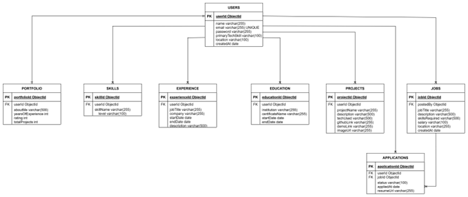
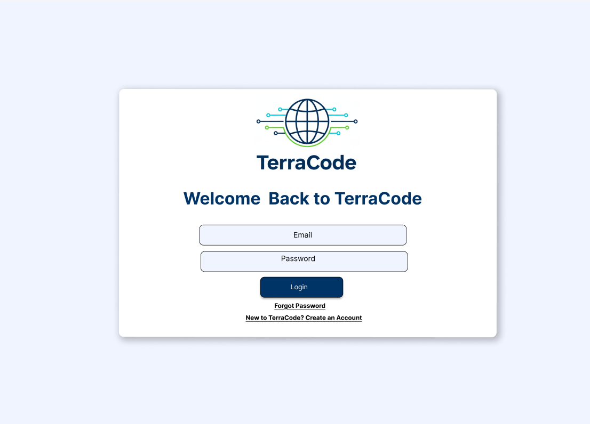
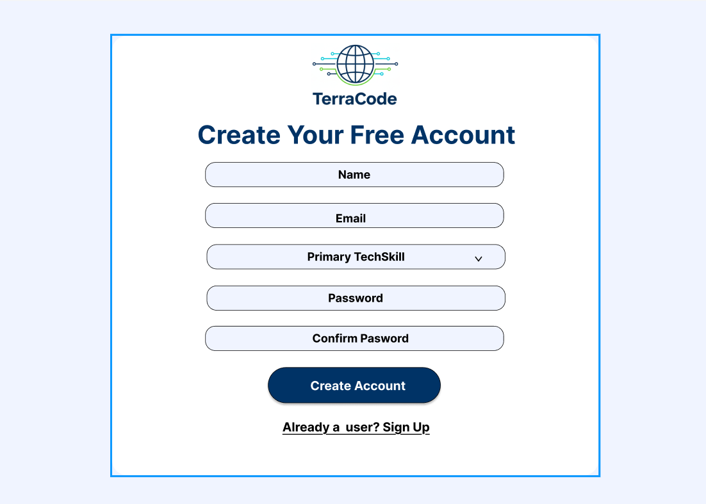
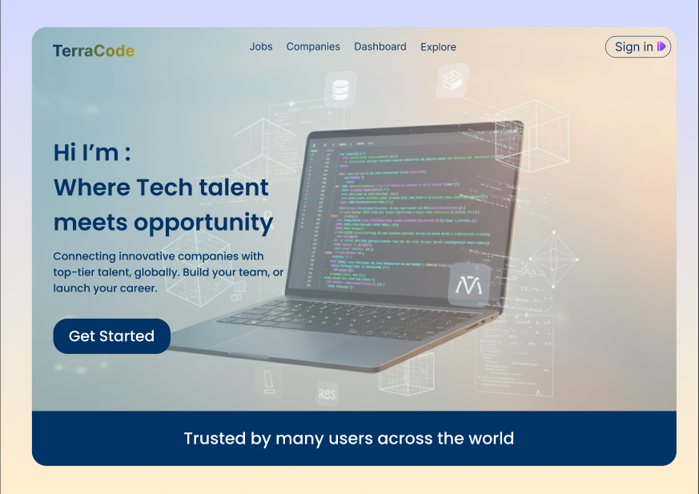
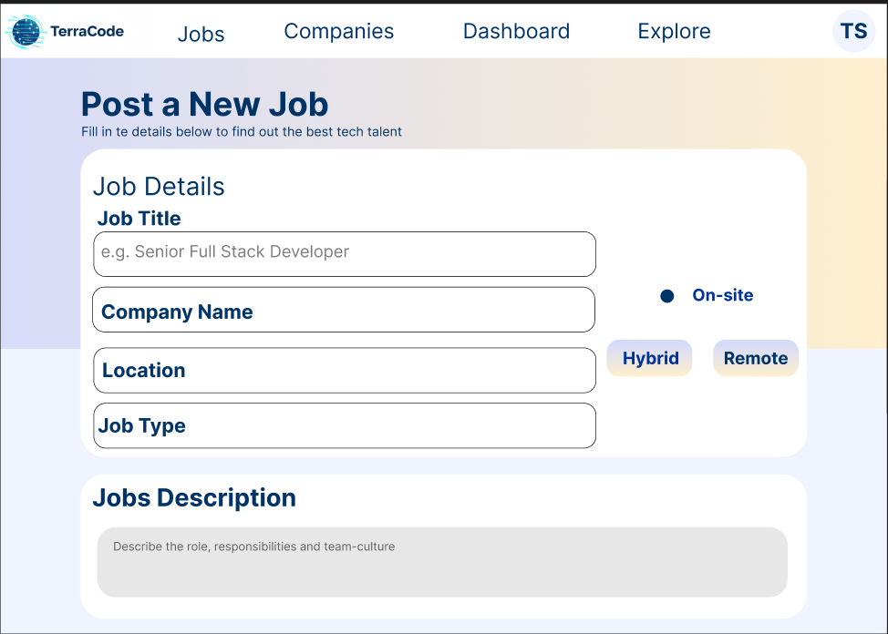

# TerraCode - Tech Talent Marketplace

A full-stack web application connecting tech professionals with companies worldwide. TerraCode enables developers to showcase their portfolios, apply for jobs, and allows companies to post positions and find talented developers.

## Features

### For Developers
- **Portfolio Management**: Create and manage professional portfolios with projects, skills, and experience
- **Job Search**: Browse and filter tech jobs by location, skills, and job type
- **Application Tracking**: Apply to jobs and track application status
- **Profile Showcase**: Display skills, ratings, and connect with potential employers
- **Social Integration**: Link GitHub, LinkedIn, and personal websites

### For Companies
- **Job Posting**: Create and manage job listings with detailed requirements
- **Candidate Discovery**: Browse developer portfolios and profiles
- **Application Management**: Review and manage job applications
- **Company Dashboard**: Track posted jobs and applicant metrics

### General Features
- **User Authentication**: Secure sign up/sign in with JWT tokens
- **Role-based Access**: Different views and permissions for developers and companies
- **Responsive Design**: Beautiful Material-UI interface that works on all devices
- **Real-time Updates**: Track portfolio views and application statuses
- **Advanced Filtering**: Search and filter by multiple criteria

## Technology Stack

### Frontend
- **React** - UI library
- **Material-UI (MUI)** - Component library and styling
- **React Router** - Client-side routing
- **Axios** - HTTP client for API requests

### Backend
- **Node.js** - Runtime environment
- **Express.js** - Web application framework
- **MongoDB** - NoSQL database
- **Mongoose** - ODM for MongoDB
- **JWT** - Authentication and authorization
- **bcrypt** - Password hashing
- **Multer** - File upload handling

## 🗄️ Database Schema Diagram (By Benjamin Nguyen)
This diagram shows all collections and relationships used in the project database.


## Getting Started

### Prerequisites
- Node.js (v14 or higher)
- MongoDB (v4.4 or higher)
- npm or yarn package manager

### Installation

1. **Clone the repository**
```bash
git clone git@github.com:ScriptedSix/TerraCode.git
cd TerraCode
```

2. **Install Backend Dependencies**
```bash
cd server
npm install
```

3. **Install Frontend Dependencies**
```bash
cd ../client
npm install
```

4. **Environment Variables**

Create a `.env` file in the `server` directory:

```env
# Server Configuration
PORT=5000
NODE_ENV=development

# Database
MONGODB_URI=mongodb://localhost:27017/terracode

# JWT Secret
JWT_SECRET=your_jwt_secret_key_here
```

5. **Start MongoDB**
```bash
# Make sure MongoDB is running
mongod
```

6. **Run the Application**
7. 
**Use concurrent deployement:**
```bash
# make sure you have concurrently installed
yarn dev
```

The application will be available at:
- Frontend: `http://localhost:5179`
- Backend API: `http://localhost:3000`

## 📡 API Endpoints
**API Usage Examples & Testing Summary (By Jinha Park)**
This section summarizes how the backend APIs were tested using Postman with a connected MongoDB Atlas environment.
The goal of the testing was to verify backend correctness, API stability, and role-based access control across Authentication, Portfolio, Job Postings, Applications, and Admin modules.

## 1. Authentication Tests

### Register
```json
POST /api/auth/register
{
  "name": "Test User",
  "email": "test_user@example.com",
  "password": "123456"
}
```

### Login
```json
POST /api/auth/login
{
  "email": "test_user@example.com",
  "password": "123456"
}
```

### Token Verification
```json
GET /api/auth/me
Authorization: Bearer <token>
```

## 2. Portfolio & Projects CRUD

### Add Project
```json
POST /api/portfolios/project
Authorization: Bearer <token>
{
  "title": "Example Project",
  "description": "Sample test",
  "techStack": ["Node.js", "React"]
}
```

**Verified Behaviors**

- Create / Update / Delete project works  
- Users cannot modify another user’s portfolio  
- “My Portfolio” and “Public Portfolio” both returned correct data
---

## 3. Job Posting (Company Only)

### Create Job
```json
POST /api/jobs
Authorization: Bearer <company_token>
{
  "title": "Backend Developer",
  "location": "Toronto",
  "skills": ["Node.js"],
  "jobType": "full-time"
}
```

**Verified Behaviors**

- Only company accounts can create jobs  
- Developers receive 403 Forbidden on POST /api/jobs  
- Job listing page correctly shows available jobs  
- Filtering by jobType / location / skills returns correct results  
---

## 4. Job Applications

### Apply to Job
```json
POST /api/applications
Authorization: Bearer <developer_token>
{
  "jobID": "<job_id>",
  "coverLetter": "I am interested in this role.",
  "resume": "https://resume-link"
}
```

**Verified Behaviors**

- Developer can successfully apply  
- Company can view all applicants for their job  
- Company can update application status  
- Developer can delete (withdraw) their own application  

---

## 5. Admin Privilege Tests

### View All Users
```json
GET /api/users
Authorization: Bearer <admin_token>
```

### Admin Deleting a User
```json
DELETE /api/users/<user_id>
Authorization: Bearer <admin_token>
```

**Verified Behaviors**
- Admin can view all users  
- Admin can delete any user  
- Admin can delete any job  
- Developers & companies are correctly blocked (403 Forbidden)  

---

## Testing Conclusion

All backend API modules performed as expected:

- JWT authentication works reliably  
- Role-based permissions enforced correctly  
- CRUD operations validated for Portfolios, Jobs, and Applications  
- Admin-only routes operate as intended  
- No unauthorized access during negative test cases  
- A complete screenshot-based testing document (17 pages) is stored in the team folder  

The backend is stable and feature-complete for the **First Release**.

---


### Authentication
- `POST /api/auth/register` - Register new user
- `POST /api/auth/login` - Login user
- `GET /api/auth/me` - Get current user (protected)

### Users
- `GET /api/users/:id` - Get user by ID
- `PUT /api/users/:id` - Update user (protected)
- `DELETE /api/users/:id` - Delete user (protected)
- `POST /api/users/upload-profile-picture` - Upload profile picture (protected)
- `GET /api/users` - Get all users (admin only)

### Jobs
- `GET /api/jobs` - Get all jobs
- `GET /api/jobs/:id` - Get job by ID
- `POST /api/jobs` - Create job (company only)
- `PUT /api/jobs/:id` - Update job (protected)
- `DELETE /api/jobs/:id` - Delete job (protected)
- `GET /api/jobs/company/:companyId` - Get jobs by company

### Portfolios
- `GET /api/portfolios` - Get all portfolios
- `POST /api/portfolios` - Create/Update portfolio (protected)
- `GET /api/portfolios/my-portfolio` - Get current user's portfolio (protected)
- `GET /api/portfolios/user/:userId` - Get portfolio by user ID
- `DELETE /api/portfolios/:id` - Delete portfolio (protected)
- `POST /api/portfolios/project` - Add project to portfolio (protected)
- `PUT /api/portfolios/project/:projectId` - Update project (protected)
- `DELETE /api/portfolios/project/:projectId` - Delete project (protected)

### Applications
- `POST /api/applications` - Apply to job (protected)
- `GET /api/applications/my-applications` - Get user's applications (protected)
- `GET /api/applications/job/:jobId` - Get applications for job (protected)
- `PUT /api/applications/:id` - Update application status (protected)
- `DELETE /api/applications/:id` - Delete application (protected)

## UI Components

### Pages
- **Home** - Landing page with features showcase
- **Job Listings** - Browse and search jobs with filters
- **Job Details** - Detailed job view with application form
- **Portfolios** - Browse developer portfolios with ratings
- **Portfolio Details** - Individual portfolio view with projects
- **Dashboard** - User dashboard with stats and applications
- **Employer Dashboard** - Company dashboard for job management
- **Sign In/Sign Up** - Authentication pages
  
## Authentication & Authorization

The application uses JWT (JSON Web Tokens) for authentication:

1. User registers/logs in
2. Server generates JWT token
3. Token stored in localStorage
4. Token sent with each API request
5. Server verifies token and authorizes actions

**User Roles:**
- `developer` - Can create portfolios, apply to jobs
- `company` - Can post jobs, view applications
- `admin` - Full access to all resources

## 🎨 UI Designs (By Tabya)

All UI mockups and design assets for TerraCode are stored in the `designs/` directory.

### 🔐 Sign In Page


### 📝 Sign Up Page


### 👤 User Profile
.png)

### 👤 Public Profile
.png)

### 🏠 Landing Page


### 💼 Job Posting



- Jihna Park - Tester [GitHub](https://github.com/jpark290)
- Elizaveta Semenova - Project Manager [GitHub](https://github.com/SemenovaLiza)
- Kelly Cyusa - Frontend Developer [GitHub](https://github.com/ckelly39)
- Tesneem Awuti - Backend Developer [GitHub](https://github.com/Tesneem-Uyghur)
- Tabya Kaur Sarao - Designer [GitHub](https://github.com/tabyasarao)
- Benjamin Nguyen - Data Engineer [GitHub](https://github.com/benjaminthienan)


**Made with ❤️ by the ScriptedSix Team**
